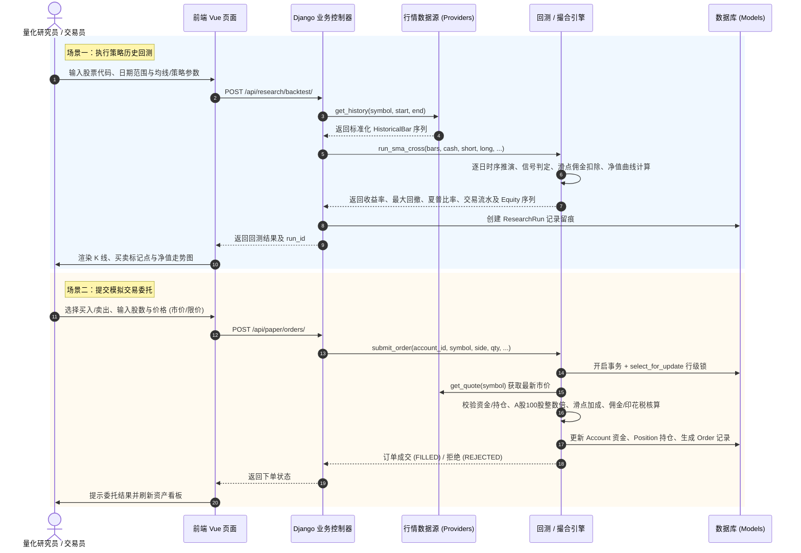
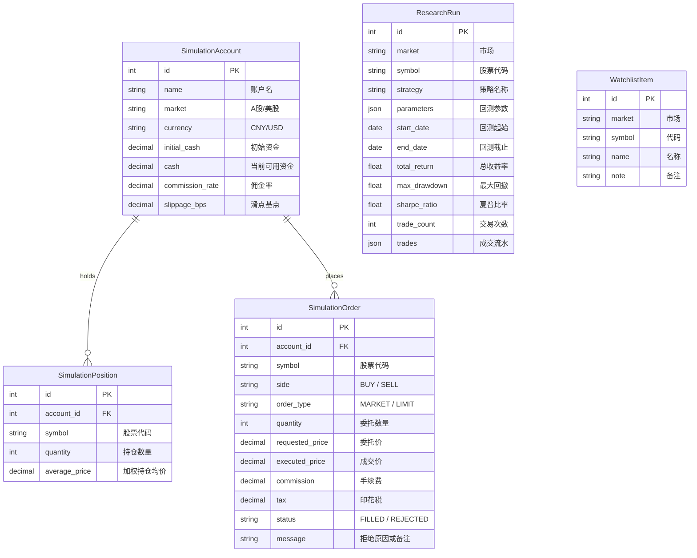

# 智能量化股票投研与模拟交易系统 (Stock Clone Platform)

## 📋 1. 项目概述与核心定位

本项目是一套基于 **Django 5 + Vue 3 + ECharts** 的全栈金融量化投研、技术指标信号计算、策略回测、资金风控以及模拟/实盘交易系统。

系统提供量化投研与模拟交易能力：

1. **轻量级动态投研与模拟交易体系**：支持 A股/美股 跨市场多数据源实时行情、交互式均线交叉/多因子量化回测、资金净值曲线计算、账户资产组合管理与带原子并发锁的模拟撮合引擎。
---

## 🏗️ 2. 系统架构与数据流图

### 2.1 系统整体分层架构

```Python
graph TD
    subgraph 前端展现层 (Vue 3 + Vite + ECharts)
        UI_Home[系统主控台 Index.vue]
        UI_Research[量化投研终端 ResearchTerminal.vue]
        UI_Earnings[收益总览看板 EarningsOverview.vue]
        UI_Trades[交易流水明细 TransactionDetails.vue]
        UI_Backtest[回测深度报告 BacktestDetails.vue]
    end

    subgraph API路由与控制器层 (Django 5)
        API_Market[行情接口 /api/market/*]
        API_Paper[模拟交易接口 /api/paper/*]
        API_Research[量化回测接口 /api/research/*]
        API_Watchlist[自选股接口 /api/watchlist/*]
        API_Cache[回测缓存接口 /api/cache/*]
    end

    subgraph 核心业务逻辑与引擎层
        MD_Engine[多市场行情接入引擎 providers.py]
        PT_Engine[模拟撮合与风控结算引擎 paper_trading.py]
        QR_Engine[SMA/因子动态回测引擎 quant_research.py]
        Signal_Lib[技术指标与信号生成库 signal_library.py]
        Metrics_Mod[高级绩效与归因分析 advanced_metrics.py]
        Cache_Mod[回测缓存与数据校验 cache_views.py]
        Adapter_Mod[实盘终端兼容适配层 system_adapter.py]
    end

    subgraph 数据存储与外部接口
        DB_SQLite[(SQLite / MySQL 数据库)]
        Cache_JSON[(JSON 预计算回测缓存)]
        Source_AKShare[Akshare 东方财富/新浪 A股接口]
        Source_Yahoo[Yahoo Finance 美股 v8 API]
        Trader_QMT[迅投 QMT / 同花顺 实盘客户端]
    end

    UI_Research --> API_Market & API_Research
    UI_Earnings --> API_Cache
    UI_Trades --> API_Paper
    UI_Backtest --> API_Cache

    API_Market --> MD_Engine
    API_Paper --> PT_Engine
    API_Research --> QR_Engine
    API_Cache --> Cache_Mod

    MD_Engine --> Source_AKShare & Source_Yahoo
    QR_Engine --> Signal_Lib & Metrics_Mod
    PT_Engine --> MD_Engine & DB_SQLite
    Adapter_Mod --> Trader_QMT
    Cache_Mod --> Cache_JSON
```

### 2.2 核心量化回测与模拟交易业务流



---

## 💻 3. 技术栈与环境依赖

- **后端核心**: Python 3.10+, Django 5.1+, Pandas, NumPy, Requests
- **行情数据源**: AkShare (A股行情/历史数据), Yahoo Finance API (美股行情/历史数据)
- **前端技术**: Vue 3, TypeScript, Vite, Vue Router, ECharts 5, CSS 模块化
- **数据库**: SQLite 3 (默认嵌入式轻量部署) / 可无缝切换至 MySQL 8.0+
- **实盘接口适配**: 迅投 QMT (XtQuant) / 同花顺 Trader 跨平台兼容抽象层

---

## 🗂️ 4. 项目目录结构与文件职责

```
stock-clone/
├── README.md                           # 系统主文档（当前文件）
├── start_system.sh                     # 前后端一键启动与依赖检测脚本
├── database_setup.py                   # 数据库迁移与初始配置脚本
├── init_database.py                    # 历史行情数据表初始化脚本
├── API接口文档.md                       # API 详细说明文档
├── OHLC_Fix_Recommendations.md         # K线数据修复与建议文档
│
├── backend/                            # 后端核心源码
│   ├── manage.py                       # Django 命令行入口
│   ├── start_server.py                 # 后端快速启动入口 (绑定 0.0.0.0:8002)
│   ├── requirements.txt                # 后端 Python 依赖清单
│   ├── db.sqlite3                      # 默认 SQLite 数据库
│   │
│   ├── myproject/                      # Django 主配置工程
│   │   ├── settings.py                 # 数据库、CORS、已注册应用全局配置
│   │   ├── urls.py                     # 全局顶级路由分发
│   │   ├── wsgi.py / asgi.py           # WSGI/ASGI 网关
│   │
│   ├── stockmarket/                    # 现代化量化投研与模拟交易应用
│   │   ├── models.py                   # 数据库 ORM (账户/订单/持仓/回测记录/日K等)
│   │   ├── trading_views.py            # REST API 视图控制器
│   │   ├── paper_trading.py            # 模拟撮合、风控校验与加权持仓成本引擎
│   │   ├── quant_research.py           # SMA 双均线交叉策略回测与绩效计算
│   │   ├── analytics.py                # 账户资产走势与绩效归因计算
│   │   └── urls.py                     # stockmarket 子路由注册
│   │
│   ├── market_data/                    # 跨市场行情接入层
│   │   ├── __init__.py                 # 模块导出与工厂函数 get_provider
│   │   └── providers.py                # AShareProvider (Akshare) & YahooFinanceProvider
│   │
│   ├── signal_library.py               # 交易信号库 (基础突破/MACD金叉/均线多空/智能组合)
│   ├── advanced_metrics.py             # 高级绩效度量模块 (夏普比率/最大回撤/胜率等)
│   ├── trade_analysis.py               # 交易记录分组与统计分析
│   ├── cache_views.py                  # 回测结果缓存读取与前端数据适配 API
│   ├── data_quality_validator.py       # OHLC 数据清洗与完整性校验器
│   ├── time_range_validator.py         # 回测时间区间有效性校验
│   ├── filter_stocks.py                # 选股过滤模块
│   ├── tushare_huoqu.py                # Tushare 数据获取脚本
│   ├── system_adapter.py               # 跨平台操作系统与实盘交易模块适配器
│   ├── xtclient_compatible.py          # 迅投客户端跨平台兼容层
│   ├── xtdata_compatible.py            # 迅投行情数据接口跨平台兼容层
│   │
│   ├── cache/                          # 预计算回测结果 JSON 缓存目录
│   └── trading_system/                 # 实盘与仿真交易调度框架 (QMT / 同花顺)
│
└── frontend/                           # 前端 Vue 3 源码
    ├── package.json                    # 前端依赖配置
    ├── vite.config.js                  # Vite 构建与代理配置
    ├── tsconfig.json                   # TypeScript 配置
    ├── index.html                      # 单页应用 HTML 入口
    ├── backtest.html                   # 独立回测展示页
    ├── stock-analysis.html             # 独立个股分析页
    └── src/
        ├── App.vue                     # 根组件
        ├── main.ts                     # 前端入口
        ├── router/index.ts             # 前端页面路由定义
        ├── layouts/DefaultLayout.vue   # 基础布局框架 (侧边栏/导航条)
        ├── views/                      # 核心业务页面
        │   ├── Index.vue               # 平台主页
        │   ├── ResearchTerminal.vue    # 量化投研终端 (实时行情+参数回测+K线图)
        │   ├── EarningsOverview.vue    # 策略历史收益总览 (多阶段/多策略对比)
        │   ├── TransactionDetails.vue  # 交易流水明细
        │   └── BacktestDetails.vue     # 回测详细报告
        ├── components/                 # 业务通用组件 (K线图、收益卡片等)
        └── api/                        # Axios HTTP 请求封装
```

---

## ⚙️ 5. 核心功能模块与具体实现逻辑

### 5.1 跨市场多数据源行情接入层 ([backend/market_data/providers.py](backend/market_data/providers.py))

#### 实现逻辑与机制

1. **统一抽象层**: 定义 `MarketDataProvider` 抽象基类，规范 `get_quote(symbol)`（实时快照）与 `get_history(symbol, start, end)`（历史日K）接口契约。
2. **A股行情提供者 (`AShareProvider`)**:
   - 依赖 `akshare`，优先使用 `stock_zh_a_spot_em()`（东方财富数据源），遇到网络波动或异常时自动降级 fallback 到 `stock_zh_a_spot()`（新浪数据源）。
   - 内置 10 秒 Monotonic 时间窗口的内存快照缓存，防止并发请求对上游接口造成高频冲击。
   - 历史 K 线调用 `stock_zh_a_hist`，自动处理前复权（`adjust='qfq'`），清洗为统一的 `HistoricalBar` 对象。
3. **美股行情提供者 (`YahooFinanceProvider`)**:
   - 对接 Yahoo Finance v8 API (`https://query1.finance.yahoo.com/v8/finance/chart/{symbol}`)。
   - 1分钟线聚合提取最新价、开高低收、成交量，标准化转换 Unix 时间戳为 UTC 时间。

---

### 5.2 技术指标与交易信号生成库 ([backend/signal_library.py](backend/signal_library.py))

#### 信号常量编码 (`SIGNAL_CODES`)

```python
SIGNAL_CODES = {
    'golden_cross': 0,        # 金叉
    'death_cross': 1,         # 死叉
    'holder_reduce': 2,       # 股东减持
    'holder_add': 3,          # 股东增持
    'holder_dividend': 4,     # 股东分红
    'violation_letter': 5,    # 问询函/违规
    'st': 9,                  # ST 股票风险
    'buy_signal': 15,         # 最终买入触发信号
    'sell_signal': 16         # 最终卖出触发信号
}
```

#### 策略信号实现逻辑

- **基础突破策略 (`basic`)**: 监测收盘价突破 N 日最高价或设定阈值时发出买入信号（状态码 15）；跌破均线或支撑价时发出卖出信号（状态码 16）。
- **MACD 金叉/死叉策略 (`macd_golden` / `macd_death`)**: 计算快线 DIF (12, 26) 与慢线 DEA (9)，当 $DIF_{t-1} \le DEA_{t-1}$ 且 $DIF_t > DEA_t$ 时判定为金叉买入；反之判定为死叉卖出。
- **均线多头/空头排列 (`ma_bullish` / `ma_bearish`)**: 计算 MA5, MA10, MA20, MA60，当满足 $MA5 > MA10 > MA20 > MA60$ 且处于上升趋势时发出买入信号。
- **智能多因子组合策略 (`smart`)**: 综合 MACD 动量、均线多头趋势、成交量异动（成交量放大 1.5 倍以上）及排除风险因素（ST、减持公告），进行加权打分后输出交易决策。

---

### 5.3 双轨量化回测引擎与绩效计算

系统提供以下量化回测与绩效分析能力：

#### 1. 动态 SMA 交叉投研回测引擎 ([backend/stockmarket/quant_research.py](backend/stockmarket/quant_research.py))

- **时序推演**: 逐根 K 线遍历，维护现金余额 `cash`、持仓数量 `shares` 与历史净值 `equity_curve`。
- **滑点与交易摩擦**: 买入执行价 $P_{buy} = P_{close} \times (1 + slip)$，卖出执行价 $P_{sell} = P_{close} \times (1 - slip)$，扣除佣金 $Commission = Amount \times rate$。
- **回测留痕**: 执行完毕后将回测参数、指标及明细自动持久化至 [backend/stockmarket/models.py](backend/stockmarket/models.py) 中的 `ResearchRun` 表，返回全局唯一 `run_id`。

#### 2. 绩效度量数学公式与实现 ([backend/advanced_metrics.py](backend/advanced_metrics.py))

- **总收益率 ($TotalReturn$)**:

  $$
  TotalReturn = \frac{Equity_{final} - Equity_{initial}}{Equity_{initial}} \times 100\%
  $$
- **年化夏普比率 ($SharpeRatio$)** (设年交易日为 252 天，无风险年利率 $R_f = 3\%$):

  $$
  Sharpe = \frac{\bar{R}_p - R_f^{daily}}{\sigma_{R_p}} \times \sqrt{252}
  $$
- **最大回撤 ($MaxDrawdown$)**:

  $$
  Peak_t = \max_{0 \le \tau \le t}(Equity_\tau)
  $$

  $$
  MaxDrawdown = \max_t \left( \frac{Peak_t - Equity_t}{Peak_t} \right) \times 100\%
  $$
- **胜率 ($WinRate$)**:

  $$
  WinRate = \frac{N_{profitable\_trades}}{N_{completed\_trades}} \times 100\%
  $$

---

### 5.4 模拟交易与资金风控结算系统 ([backend/stockmarket/paper_trading.py](backend/stockmarket/paper_trading.py))

#### 撮合与结算流程

1. **并发控制**: 使用 Django `transaction.atomic()` 结合 `select_for_update()` 对账户记录加行级排他锁，杜绝并发请求造成的超买超卖。
2. **A股特定交易规则**: 买入股数必须为 100 股（1手）的整数倍；卖出时单向加征印花税（默认 0.05% 或 0.1%）。
3. **加权持仓成本核算**:
   - 买入时新平均成本：
     $$
     Cost_{new} = \frac{Shares_{old} \times Cost_{old} + Shares_{buy} \times Price_{buy}}{Shares_{old} + Shares_{buy}}
     $$
   - 卖出时扣减持仓数量，当持仓减至 0 时自动销毁持仓实体 `SimulationPosition`。
4. **订单状态机**: 支持待成交 `PENDING`、已成交 `FILLED`、已拒绝 `REJECTED`（资金不足、标的无法获取市价、持仓不足等均记录详细拒绝原因）。

---

### 5.5 数据缓存与质量校验机制

- **预计算缓存体系 ([backend/cache_views.py](backend/cache_views.py))**:
  将大规模股票池在多个历史区间（如 2022、2023、2024 年度及最新全周期）的回测结果预生成为 JSON 存入 [backend/cache/](backend/cache/)。前端通过 `/api/cache/backtest-details/` 可在 10ms 内极速加载上万笔交易的聚合分析。
- **OHLC 数据质量校验 ([backend/data_quality_validator.py](backend/data_quality_validator.py))**:
  校验 K 线数据的一致性规则：

  $$
  High \ge \max(Open, Close)
  $$

  $$
  Low \le \min(Open, Close)
  $$

  $$
  Volume \ge 0
  $$

  自动识别异常跳空与数据缺失并输出诊断报告。

---

### 5.6 前端可视化与交互体系 ([frontend/src/](frontend/src/))

- **量化投研终端 ([frontend/src/views/ResearchTerminal.vue](frontend/src/views/ResearchTerminal.vue))**:
  - 集成股票代码实时联想搜索。
  - 动态策略参数调节面板（快均线、慢均线、滑点、初始资金、日期范围）。
  - ECharts 交互式图表：K 线蜡烛图叠加 MA 均线指标、买卖信号点标记（Buy: 红箭头, Sell: 绿箭头）以及下方同步资金净值（Equity）曲线。
- **收益总览看板 ([frontend/src/views/EarningsOverview.vue](frontend/src/views/EarningsOverview.vue))**:
  - 展示多周期、多策略对比矩阵、胜率雷达图与超额收益分布。
- **交易明细流水 ([frontend/src/views/TransactionDetails.vue](frontend/src/views/TransactionDetails.vue))**:
  - 支持逐笔交易筛选、方向过滤、买卖费用分摊与持仓盈亏透视。

---

## 🔌 6. REST API 接口定义

| 接口分类           | HTTP 方法        | URL 路径                                | 功能说明                       | 关键参数                                                                                                  |
| ------------------ | ---------------- | --------------------------------------- | ------------------------------ | --------------------------------------------------------------------------------------------------------- |
| **行情数据** | `GET`          | `/api/market/quotes/`                 | 获取实时行情快照               | `market` (A/US), `symbols` (如 000001,AAPL)                                                           |
| **模拟账户** | `GET`          | `/api/paper/accounts/`                | 获取模拟账户列表               | 无                                                                                                        |
| **模拟账户** | `POST`         | `/api/paper/accounts/`                | 创建新的模拟账户               | `name`, `market`, `initial_cash`                                                                    |
| **模拟账户** | `GET`          | `/api/paper/accounts/<id>/summary/`   | 账户资产总览及实时持仓浮盈     | 路径参数`account_id`                                                                                    |
| **模拟账户** | `GET`          | `/api/paper/accounts/<id>/analytics/` | 账户历史表现与归因分析         | 路径参数`account_id`                                                                                    |
| **模拟交易** | `GET`          | `/api/paper/orders/`                  | 查询订单列表                   | 可选`account_id` 过滤                                                                                   |
| **模拟交易** | `POST`         | `/api/paper/orders/`                  | 提交买入/卖出委托订单          | `account_id`, `symbol`, `side`, `quantity`, `order_type`, `price`                             |
| **量化投研** | `POST`         | `/api/research/backtest/`             | 执行在线策略回测               | `symbol`, `market`, `short_window`, `long_window`, `start_date`, `end_date`, `initial_cash` |
| **量化投研** | `GET`          | `/api/research/runs/`                 | 获取历史回测执行记录列表       | 可选`symbol`, `market`                                                                                |
| **量化投研** | `GET`          | `/api/research/runs/<id>/`            | 获取特定回测记录详情及交易流水 | 路径参数`run_id`                                                                                        |
| **自选股**   | `GET`/`POST` | `/api/watchlist/`                     | 获取或添加自选股               | `symbol`, `market`, `name`, `note`                                                                |
| **自选股**   | `DELETE`       | `/api/watchlist/<id>/`                | 删除自选股                     | 路径参数`item_id`                                                                                       |
| **缓存数据** | `GET`          | `/api/cache/backtest-details/`        | 读取预计算回测深度数据         | 无                                                                                                        |
| **缓存状态** | `GET`          | `/api/cache/status/`                  | 查询缓存文件状态及更新时间     | 无                                                                                                        |

---

## 🗄️ 7. 数据库核心实体关系 (ORM)



---

## 🚀 8. 快速开始与环境部署

### 8.1 环境准备

- **Python**: 3.10 或更高版本
- **Node.js**: 18.0 或更高版本 (推荐 Node.js 20 LTS)
- **包管理器**: `pip` 与 `npm` / `pnpm`

### 8.2 一键启动 (推荐)

项目根目录提供了全自动启动脚本：

```bash
# 赋予执行权限并启动前后端所有服务
chmod +x start_system.sh
./start_system.sh all
```

### 8.3 手动分步启动

#### 1. 后端服务启动

```bash
cd backend

# 安装后端依赖
pip install -r requirements.txt

# 数据库迁移
python manage.py migrate

# 启动 Django API 服务 (默认端口 8002)
python start_server.py
```

> 后端服务运行地址: `http://127.0.0.1:8002`

#### 2. 前端服务启动

```bash
cd frontend

# 安装前端依赖
npm install

# 启动 Vite 开发服务器
npm run dev
```

> 前端界面访问地址: `http://localhost:3000` (或控制台输出的 Vite 本地地址)

---

## 🛠️ 9. 二次开发与功能扩展指引

### 9.1 新增自定义技术指标

1. 打开 [backend/signal_library.py](backend/signal_library.py) 或在指标目录中新建计算函数。
2. 输入为标准的 Pandas DataFrame（包含 `open`, `high`, `low`, `close`, `volume`）。
3. 示例：
   ```python
   def calculate_rsi(df: pd.DataFrame, period: int = 14) -> pd.Series:
       delta = df['close'].diff()
       gain = (delta.where(delta > 0, 0)).rolling(window=period).mean()
       loss = (-delta.where(delta < 0, 0)).rolling(window=period).mean()
       rs = gain / loss
       return 100 - (100 / (1 + rs))
   ```

### 9.2 开发并注册新量化策略

1. 在 [backend/stockmarket/quant_research.py](backend/stockmarket/quant_research.py) 中编写策略函数（如 `run_rsi_strategy(bars, ...)`）。
2. 在 [backend/stockmarket/trading_views.py](backend/stockmarket/trading_views.py) 的 `research_backtest` 视图中添加参数路由分发。
3. 在 [frontend/src/views/ResearchTerminal.vue](frontend/src/views/ResearchTerminal.vue) 添加对应策略的参数输入控件。

### 9.3 接入新的行情数据源（如加密货币或港股）

1. 在 [backend/market_data/providers.py](backend/market_data/providers.py) 中新建子类继承 `MarketDataProvider`：
   ```python
   class CryptoProvider(MarketDataProvider):
       market = "CRYPTO"
       def get_quote(self, symbol: str) -> Quote:
           # 实现实时行情获取
           pass
       def get_history(self, symbol: str, start: date, end: date) -> list[HistoricalBar]:
           # 实现历史 K 线获取
           pass
   ```
2. 在 `get_provider(market)` 工厂函数中注册该 Provider 即可全局生效。

---

## ❓ 10. 常见问题排查 (FAQ)

1. **A股行情获取超时或提示缺少依赖？**
   - 确保已正确安装 `akshare`：`pip install akshare --upgrade`。
   - `AShareProvider` 内置了东方财富与新浪双通道降级容错机制。
2. **跨域请求报错 (CORS Error)？**
   - 检查 [backend/myproject/settings.py](backend/myproject/settings.py) 中的 `CORS_ALLOW_ALL_ORIGINS = True` 及 `corsheaders` 中间件是否处于最前列。
3. **前端图表无法显示或数据为空？**
   - 确认回测区间包含有效交易日且非停牌期间。
   - 检查浏览器控制台 Network 请求，确认 `http://127.0.0.1:8002/api/research/backtest/` 返回 `success: true`。

---

## 📄 11. 维护说明

本项目代码遵循系统工程化规范，方便后期模块扩展与维护。真实市场交易请严格遵循合规风控要求。

**注意**: 本系统仅用于学习和研究目的，实际投资请谨慎操作并遵守相关法律法规。
