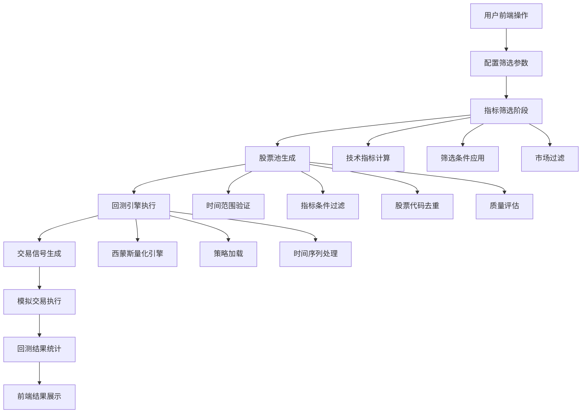
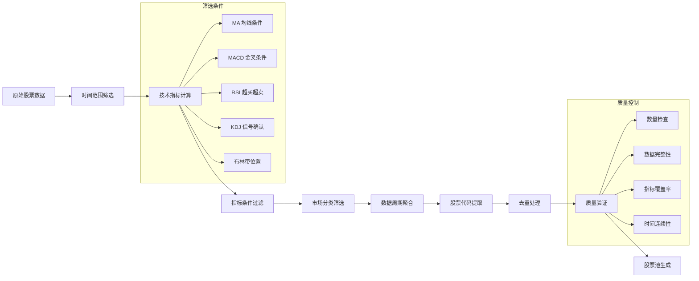
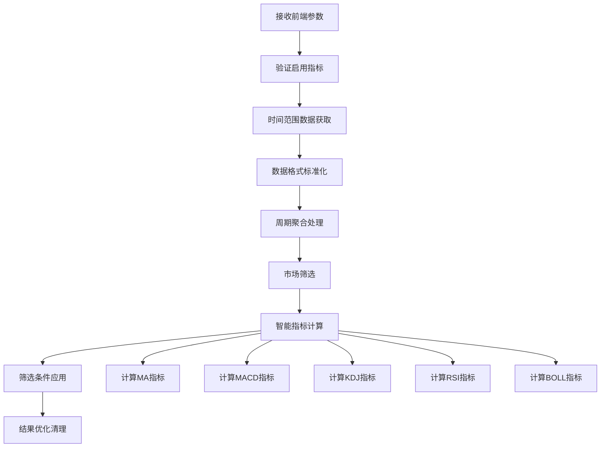
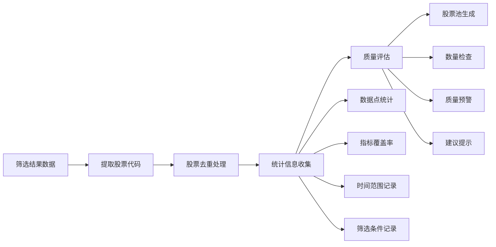
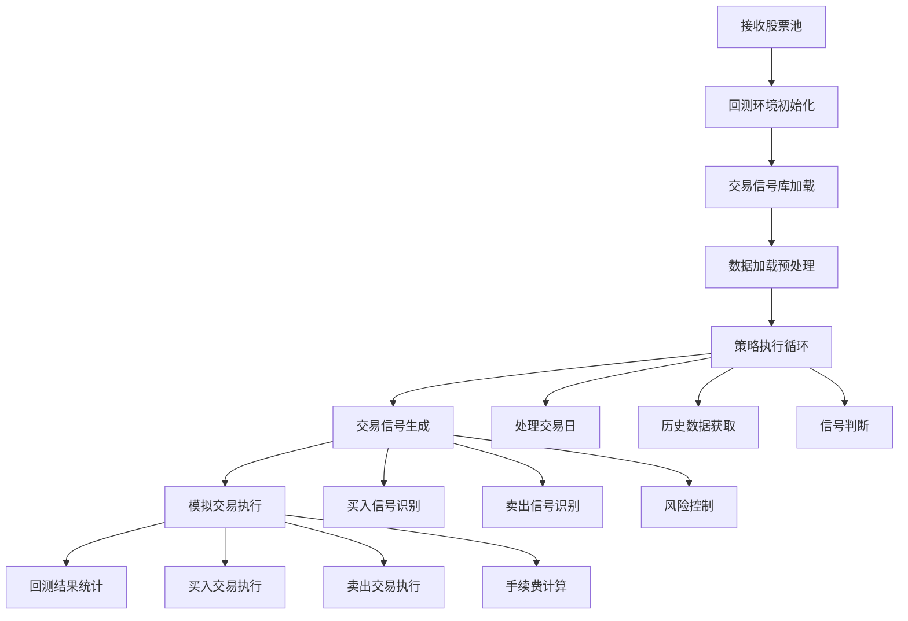
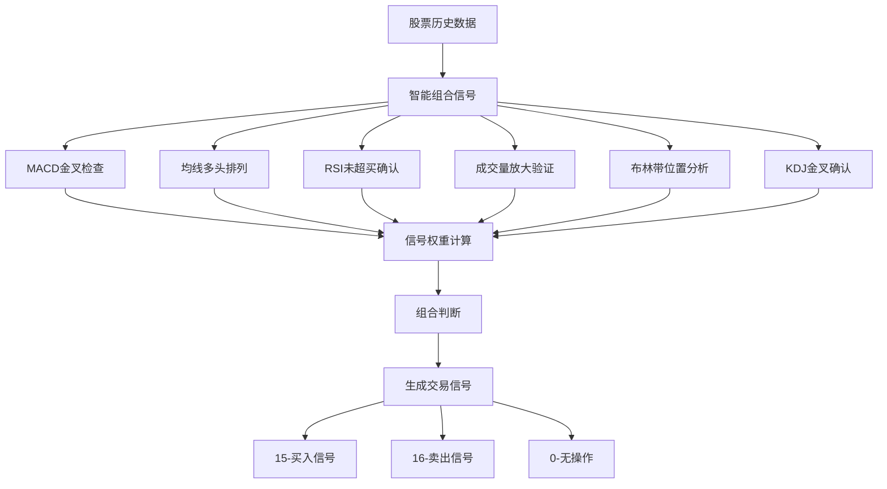
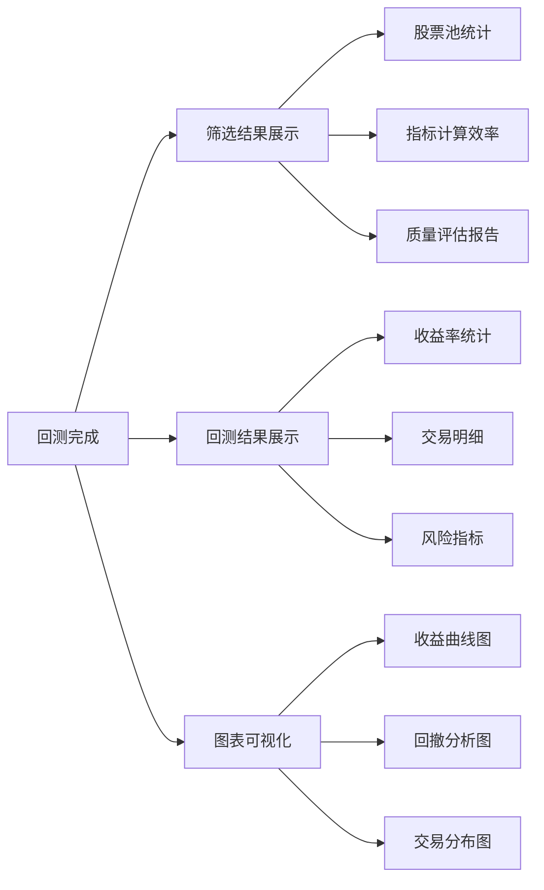
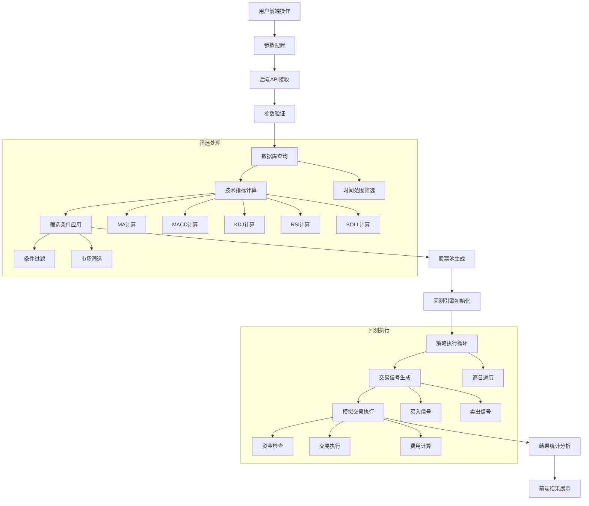

# 技术架构文档

## 🏗️ 系统架构

### 整体架构图

```
┌─────────────────┐    ┌─────────────────┐    ┌─────────────────┐
│   前端 Web 界面   │    │   Django API     │    │   量化回测引擎    │
│                 │    │    服务层        │    │                 │
│  - 股票分析页面   │◄───┤                 ├───►│  - XMS Quant     │
│  - 回测结果展示   │    │  - REST API     │    │  - 策略执行      │
│  - 配置管理      │    │  - CORS 支持    │    │  - 回测计算      │
└─────────────────┘    └─────────────────┘    └─────────────────┘
                                │
                                ▼
                       ┌─────────────────┐
                       │   交易信号库     │
                       │                 │
                       │  - 信号生成      │
                       │  - 交易执行      │
                       │  - 账户管理      │
                       │  - 历史记录      │
                       └─────────────────┘
                                │
                                ▼
                       ┌─────────────────┐
                       │   技术指标库     │
                       │                 │
                       │  - MA, MACD     │
                       │  - KDJ, RSI     │
                       │  - 50+ 指标     │
                       └─────────────────┘
                                │
                                ▼
                       ┌─────────────────┐
                       │     数据层      │
                       │                 │
                       │  - CSV 文件     │
                       │  - MySQL 数据库  │
                       │  - Tushare API  │
                       └─────────────────┘
```

## 📦 核心组件详解

### 1. Django API 服务层

#### 技术栈
- **框架**: Django 5.2.4
- **数据库**: MySQL 
- **API 协议**: REST API
- **跨域支持**: CORS
- **认证方式**: 无需认证 (内部系统)

#### 核心 API 端点
- `/api/filter/stocks/` - 股票筛选接口
- `/api/backtest/run/` - 回测执行接口
- `/api/backtest/filter-run/` - 筛选+回测一体化接口
- `/api/results/history/` - 历史回测结果查询

### 2. 前端 Web 界面

#### 技术栈
- **框架**: 原生 HTML + JavaScript
- **样式**: CSS3 + Bootstrap
- **图表库**: Chart.js / ECharts
- **HTTP 客户端**: Fetch API

#### 功能模块
- **参数配置界面**: 技术指标选择、筛选条件设定
- **结果展示页面**: 回测结果可视化、交易明细展示
- **历史记录管理**: 回测历史查询、配置保存

### 3. 量化回测引擎

#### 核心特性
- **西蒙斯量化系统**: 基于 XMS Quant 框架
- **多策略支持**: 智能策略、MACD 策略、均线策略
- **实时计算**: 逐日回测、实时信号生成
- **风险控制**: 资金管理、止损止盈

## 🔄 股票筛选与回测完整流程

### 1. 系统概览



### 2. 股票池生成详细流程



**股票池生成核心逻辑:**

1. **时间范围数据收集**: 在用户指定的 `start_date` 到 `end_date` 时间范围内收集所有股票的历史数据
2. **技术指标批量计算**: 根据用户启用的指标列表，批量计算 MA、MACD、KDJ、RSI、BOLL 等技术指标
3. **多重筛选条件应用**: 应用用户设定的所有筛选条件，如 `MA20 > 15`, `MACD > 0` 等
4. **市场分类过滤**: 支持按上海/深圳/全市场进行股票筛选
5. **数据周期处理**: 支持日/周/月/年不同周期的数据聚合
6. **股票池质量验证**: 检查生成的股票池数量、数据完整性和指标覆盖率
7. **回测适配**: 生成的股票池直接传递给回测引擎，确保数据一致性

### 3. 前端参数配置阶段

**用户配置项目:**
- **启用的技术指标**: MA(移动平均线), MACD, KDJ, RSI, BOLL(布林带), CCI, Williams %R
- **筛选条件设置**: 如 MA20 > 15, MACD > 0 (金叉), RSI < 70 (未超买)
- **时间范围选择**: 指定筛选的开始和结束日期
- **技术指标参数**: MA周期、MACD参数、KDJ周期等
- **回测参数配置**: 初始资金、市场选择、数据周期、策略类型

### 4. 后端股票筛选处理流程



**处理步骤说明:**
1. **指标验证**: 确认用户启用的技术指标在系统支持范围内
2. **时间范围筛选**: 根据指定日期范围获取历史数据
3. **数据标准化**: 统一数据格式，确保计算准确性
4. **周期处理**: 支持日线、周线、月线、年线数据聚合
5. **市场分类**: 按上海、深圳或全市场进行股票筛选
6. **智能计算**: 只计算用户启用的指标，提升性能
7. **条件过滤**: 应用所有用户设定的筛选条件
8. **数据清理**: 处理异常值，确保数据质量

### 5. 股票池生成机制



**股票池质量控制:**
- **数量评估**: 0只股票(条件过严) / 少于5只(数量偏少) / 超过100只(建议优化)
- **数据完整性**: 检查每只股票的数据完整程度
- **指标覆盖率**: 验证技术指标计算的成功率
- **时间连续性**: 确保筛选时间范围内数据的连续性

### 6. 回测引擎执行流程



**回测执行要点:**
- **环境初始化**: 设置初始资金、手续费率、印花税等参数
- **信号库加载**: 加载交易信号生成和执行模块
- **数据预处理**: 为每只股票加载和整理历史数据
- **策略循环**: 按交易日顺序执行策略逻辑
- **信号生成**: 基于技术指标生成买卖信号
- **交易模拟**: 模拟真实交易的执行过程
- **结果统计**: 计算收益、回撤、胜率等关键指标

### 7. 交易信号生成策略



**信号生成逻辑:**
- **多指标验证**: 至少满足4个技术指标条件才生成买入信号
- **MACD金叉**: DIF线上穿DEA线，确认上升趋势
- **均线排列**: 短期均线位于长期均线之上
- **RSI控制**: 确保不在超买区域，避免高位买入
- **成交量确认**: 成交量放大验证信号有效性
- **布林带位置**: 价格在布林带合理位置区间
- **KDJ辅助**: K线上穿D线且未在超买区

### 8. 前端结果展示



**展示内容包括:**
- **筛选统计**: 股票数量、数据点数、计算效率
- **池质量**: 生成方式、时间范围、应用指标、质量评估
- **回测指标**: 总收益率、最大回撤、胜率、交易次数
- **详细信息**: 策略名称、股票池、手续费、最终价值
- **可视化**: 资金曲线、回撤分析、交易分布等图表

### 9. 性能优化要点

#### 数据库查询优化
- **索引优化**: 为时间字段、股票代码等常用查询字段建立索引
- **批量查询**: 使用 `select_related` 和 `prefetch_related` 避免 N+1 查询
- **查询范围限制**: 精确指定时间范围和股票范围，减少数据传输
- **分页处理**: 对大量数据进行分页查询，避免一次性加载过多数据

#### 指标计算并行化
- **多线程处理**: 使用线程池并行计算不同股票的技术指标
- **CPU 核心利用**: 根据系统 CPU 核心数量调整并发线程数
- **内存管理**: 合理控制并发数量，避免内存溢出
- **异常处理**: 单个股票计算失败不影响整体流程

#### 内存管理优化
- **分批处理**: 将大股票池分成小批次处理，避免内存峰值
- **数据清理**: 及时释放不需要的中间数据
- **垃圾回收**: 在批次处理间隙主动触发垃圾回收
- **缓存策略**: 合理使用缓存减少重复计算

### 10. 错误处理和监控

#### 异常处理机制
- **参数验证**: 前端传入参数的格式和范围验证
- **数据完整性检查**: 确保历史数据的完整性和准确性
- **计算异常捕获**: 技术指标计算过程中的异常处理
- **系统级错误**: 数据库连接、文件读写等系统级异常处理

#### 监控指标收集
- **执行时间监控**: 记录各个流程步骤的执行时间
- **内存使用监控**: 监控内存使用情况，预防内存泄漏
- **成功率统计**: 统计筛选和回测的成功率
- **错误日志**: 详细记录错误信息便于问题排查

### 11. 系统优化建议

#### 股票池质量监控
- **实时质量评估**: 根据股票数量、数据完整性评估池质量
- **智能建议**: 基于历史表现推荐最优筛选条件
- **市场适应性**: 根据牛市/熊市/震荡市调整筛选策略
- **条件优化**: 分析成功案例，提取最优参数组合

#### 历史表现追踪
- **配置记录**: 保存每次筛选配置和对应的回测结果
- **效果分析**: 统计不同指标组合的历史表现
- **参数调优**: 基于历史数据优化筛选参数
- **成功模式识别**: 识别高收益配置的共同特征

### 完整数据流程图



## 🛠️ 部署架构

### 开发环境

**环境要求:**
- Python 3.8+
- Django 5.2.4
- MySQL 8.0+
- Node.js (可选，用于前端工具)

**启动步骤:**

1. **后端服务启动**
   ```bash
   cd backend
   python manage.py runserver 8002
   ```

2. **前端开发服务器**
   ```bash
   cd frontend
   python -m http.server 5500
   # 或使用 VS Code Live Server
   ```

3. **数据库初始化**
   ```bash
   python manage.py migrate
   python init_database.py
   ```

### 生产环境

**架构特点:**
- **负载均衡**: Nginx 反向代理
- **应用服务**: Gunicorn + Django
- **数据库**: MySQL 主从配置
- **缓存**: Redis 缓存层
- **监控**: Prometheus + Grafana

**部署流程:**

1. **环境配置**
   - 服务器环境准备
   - 依赖包安装
   - 数据库配置

2. **应用部署**
   - 代码部署
   - 静态文件收集
   - 数据库迁移

3. **服务启动**
   - Gunicorn 进程启动
   - Nginx 配置
   - 监控服务启动

### 系统监控

**关键指标:**
- **性能指标**: 响应时间、吞吐量、错误率
- **资源指标**: CPU使用率、内存使用率、磁盘I/O
- **业务指标**: 回测成功率、股票池质量、用户活跃度

**告警机制:**
- **阈值告警**: CPU > 80%, 内存 > 85%, 磁盘 > 90%
- **错误告警**: 连续失败次数、异常错误率
- **业务告警**: 回测失败率过高、数据更新延迟

## 📊 技术指标库

### 支持的技术指标

#### 趋势类指标
- **MA (移动平均线)**: SMA, EMA, WMA
- **MACD**: 指数平滑移动平均收敛散度
- **BBI**: 多空指标
- **TRIX**: 三重指数平滑移动平均

#### 震荡类指标
- **RSI**: 相对强弱指标
- **KDJ**: 随机指标
- **CCI**: 商品通道指标
- **Williams %R**: 威廉指标

#### 量价类指标
- **BOLL**: 布林带
- **SAR**: 抛物线转向
- **ATR**: 平均真实波幅
- **OBV**: 能量潮

#### 特色指标
- **BIAS**: 乖离率
- **ROC**: 变动率指标
- **MTM**: 动量指标
- **ARBR**: 人气意愿指标

### 指标计算引擎

**计算特性:**
- **高性能**: 向量化计算，支持大数据量
- **准确性**: 标准算法实现，数值精度高
- **扩展性**: 模块化设计，易于添加新指标
- **容错性**: 异常数据处理，计算稳定

## 🔍 数据管理

### 数据源

**历史数据:**
- **来源**: Tushare Pro API
- **频率**: 日线数据
- **范围**: 2010年至今
- **字段**: 开高低收量

**实时数据:**
- **更新频率**: 每日收盘后
- **数据校验**: 自动异常检测
- **备份策略**: 增量备份
- **恢复机制**: 快速数据恢复

### 数据存储

**数据库设计:**
- **主表**: 股票历史数据表
- **索引**: 日期+股票代码联合索引
- **分区**: 按年份分区存储
- **压缩**: 数据压缩存储

**存储优化:**
- **分区策略**: 按时间分区，提高查询效率
- **索引优化**: 复合索引设计，加速筛选查询
- **数据压缩**: 历史数据压缩，节省存储空间
- **定期清理**: 清理过期临时数据

---

**文档版本**: v2.0.0  
**最后更新**: 2025-08-12  
**维护者**: 系统集成团队
